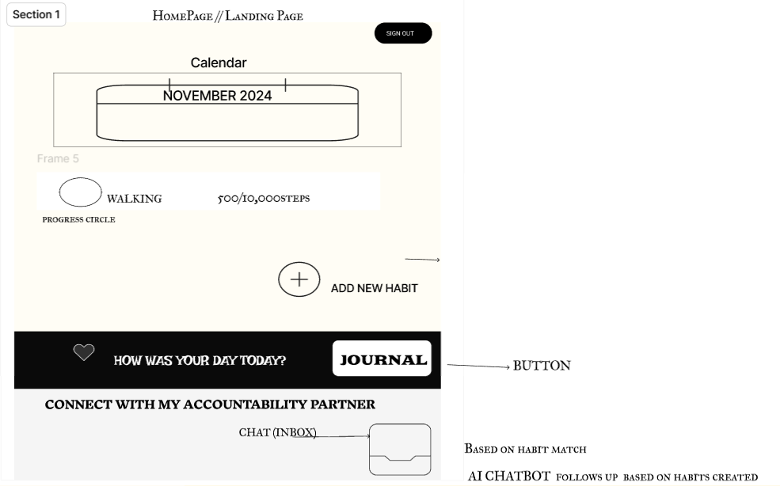
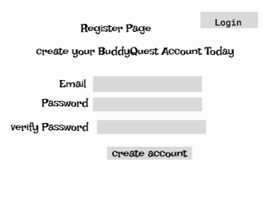
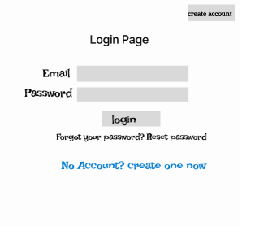
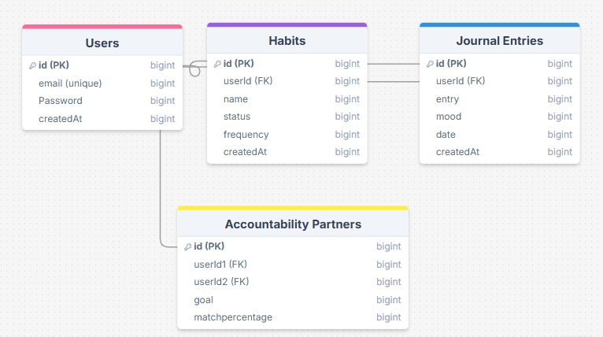

# Project Title

BuddyQuest

## Overview

BuddyQuest is a self-development platform that helps users track their habits, reflect through journaling, and connect with accountability partners to stay motivated on their personal growth journey.

### Problem

Many people struggle to maintain their self-improvement efforts due to a lack of consistent tracking and accountability. While habit trackers and journaling tools exist, they don't always integrate accountability features that help users stay on track. Having an accountability partner can significantly increase the chances of success for self-development goals.

### User Profile

- Self-improvement seekers:
  - Individuals looking to track their personal growth through habits and journaling
  - People who want to stay motivated and need accountability to maintain consistency
  - Users who want to connect with others to share and achieve their self-development goals

### Features

- As a user, I want to be able to create and track my habits
- As a user, I want to be able to log my daily reflections in a journal
- As a user, I want to track my mood to better understand my self-development journey
- As a user, I want to be able to connect with accountability partners with similar self-development goals
- As a user, I want to be able to message my accountability partner and check in on each other’s progress
- As a user, I want to earn badges for consistent habits or journaling entries to stay motivated

## Implementation

### Tech Stack

- Frontend: React
- Backend: Express.js
- Database: MySQL
- Client Libraries:
  - React Router
  - Axios
- Server Libraries:
  - Knex.js
  - bcrypt (for password hashing)

### APIs

-

### Sitemap

- Home page
- Habit Tracker page
- Journal page
- Accountability Partner Matchmaking page
- Register page
- Login page

### Mockups

#### Home Page



#### Register Page



#### Login Page



#### AI Visual habits/home Page


 
### Data



### Endpoints

## POST /users/register

Register a new user account.

## **Parameters:**

- `email`: User's email address
- `password`: User's password

## **Response:**

````json
{
    "token": "somejwt"
}  
````


### POST /users/register
  Register a new user account.

**Parameters:**
  - `email`: User's email address
  - `password`: User's password

**Response:**
  ```json
  {
      "token": "somejwt"
  }
````
## Habits

### GET /habits

Get habits for a logged-in user.

**Parameters:**

- `token`: JWT token for the logged-in user

**Response:**

```json
[
    {
        "id": 1,
        "name": "Meditation",
        "status": "In Progress"
    },
    ...
]
````
## POST /habits

Adds a new habit for the logged-in user.

### Parameters:

- `token` (required): JWT token for the logged-in user.
- `name` (required): The name of the habit.
- `frequency` (required): How often the habit should be tracked.

### Response:

A JSON object representing the newly created habit.

#### Example Response:

```json
{
    "id": 1,
    "name": "Meditation",
    "status": "In Progress"
}
````
## GET /journal

Gets journal entries for a logged-in user.

### Parameters:

- `token` (required): JWT token for the logged-in user.

### Response:

A JSON array representing the user's journal entries.

#### Example Response:

```json
[
    {
        "id": 1,
        "entry": "Today was a good day, I meditated for 20 minutes!",
        "mood": "Happy",
        "date": "2024-11-01"
    },
    ...
]
````
## POST /journal

Adds a new journal entry for the logged-in user.

### Parameters:

- `token` (required): JWT token for the logged-in user.
- `entry` (required): The text of the journal entry.
- `mood` (required): Mood scale (e.g., Happy, Sad, Motivated).

### Response:

A JSON object representing the newly created journal entry.

#### Example Response:

```json
{
    "id": 1,
    "entry": "Feeling positive about my goals today!",
    "mood": "Motivated",
    "date": "2024-11-01"
}
````
## GET /partners

Gets a list of accountability partners based on matching goals.

### Parameters:

- `token` (required): JWT token for the logged-in user.
- `goal` (required): Specific self-development goal (e.g., fitness, mindfulness).

### Response:

A JSON array representing a list of accountability partners.

#### Example Response:

```json
[
    {
        "id": 1,
        "name": "Jane Doe",
        "goal": "Fitness",
        "matchPercentage": 80
    },
    ...
]
````
## Auth

### JWT Authentication

The JWT token is used for logging in and managing state.

- The token is stored in `localStorage`.
- It is included in every request to authenticate the logged-in user.

    - Implement login page + form
    - Create POST /users/login endpoint

## Roadmap

### Frontend Setup
- Set up the React project
- Implement user interface for all key pages (login, registration, habit tracking, journal, etc.)
- Make the user interface responsive for various screen sizes

### Backend Setup
- Set up the Express.js server
- Create the necessary routes for user registration, login, habit tracking, journal entries, and accountability partners
- Implement JWT authentication for secure user login and management

### Habit Tracker
- Create the habit tracking system, allowing users to:
  - Add, update, and delete habits
  - Set habit frequencies and track progress
  - Enable habit status (e.g., "In Progress", "Completed")

### Journal Feature
- Implement a journal system where users can:
  - Add new journal entries with mood tracking
  - View past journal entries

### Accountability Partners
- Develop a system to match users with accountability partners based on shared goals (e.g., fitness, mindfulness)
- Create a messaging feature to allow communication between partners

### Testing
- Conduct unit tests for individual components and functions
- Perform integration tests to ensure smooth interaction between the frontend and backend
- User acceptance testing (UAT) to ensure all features work as expected

### Final Polish and Deployment
- Finalize user interface design and features
- Address any bug fixes or issues found during testing
- Deploy the app to a production environment for demo day

### Nice-to-haves 🔍
#### Gamification Features:
- Add badges or rewards for consistent habit tracking or journaling
- Track and display streaks for habits or journal entries

#### User Progress Analytics: 
- Provide insights into habit trends, mood changes, and progress over time

#### Social Challenges:
-  Create and join group challenges with leaderboards entries
 #### Proximity-based matching:
- Integrating GPS or Google Maps APIs