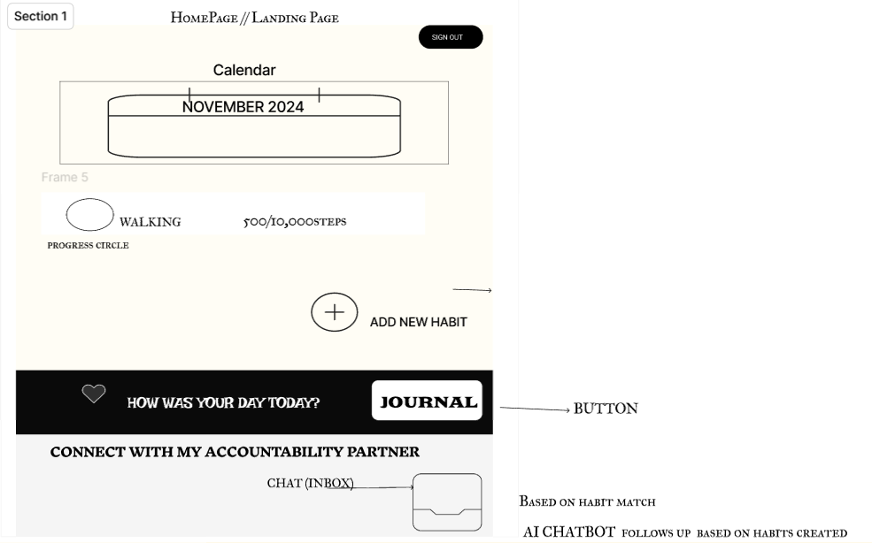
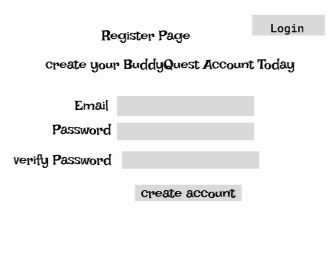
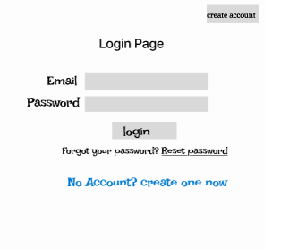

# **BuddyQuest**

BuddyQuest is a self-development platform that helps users track their habits, reflect through journaling, and connect with accountability partners to stay motivated on their personal growth journey.

---

## **Overview**

### **Problem**

Many people struggle to maintain their self-improvement efforts due to a lack of consistent tracking and accountability. While habit trackers and journaling tools exist, they don't always integrate accountability features that help users stay on track. Having an accountability partner can significantly increase the chances of success for self-development goals.

### **User Profile**

- **Self-improvement seekers**:
  - Individuals looking to track their personal growth through habits and journaling.
  - People who want to stay motivated and need accountability to maintain consistency.
  - Users who want to connect with others to share and achieve their self-development goals.

---

## **Features**

### **Core Features**

- **Habit Tracker**: Add, update, and delete habits with status tracking (e.g., "In Progress", "Completed").
- **Journaling**: Secure journaling with mood tracking and prompts for reflection.
- **Accountability Partners**: Match with users who have similar self-development goals.
- **Messaging System**: Simple communication with accountability partners.
- **Gamification**: Badges and rewards for streaks and consistent progress.

### **Stretch Goals**

- **Social Challenges**: Join or create group challenges with leaderboards.
- **User Progress Analytics**: Visualize trends in habits, moods, and goals.
- **Proximity Matching**: Use location-based matching with GPS or Google Maps APIs.

---

## **Implementation**

### **Tech Stack**

- **Frontend**: React.js (with React Router and Axios for API calls).
- **Backend**: Express.js with JWT for authentication.
- **Database**: MySQL (queries managed via Knex.js).
- **Additional Libraries**:
  - bcrypt for password hashing.
  - Chart.js or Recharts for visual analytics.

---

## **Sitemap**

1. **Home Page**: Introduction to BuddyQuest.
2. **Habit Tracker Page**: View, add, and manage habits.
3. **Journal Page**: Reflect on progress and track mood.
4. **Accountability Partner Matchmaking Page**: Find partners and message them.
5. **Register Page**: Create an account.
6. **Login Page**: Secure login for returning users.

---

## **Mockups**

### **Home Page**

### **Register Page**

### **Login Page**

### **Habit Tracker Page (AI-Generated Visuals)**

---

## **Data**

### **Database Schema**

- **Users**
  - `id`, `email`, `password`, `createdAt`.
- **Habits**
  - `id`, `userId`, `name`, `frequency`, `createdAt`.
- **Journal Entries**
  - `id`, `userId`, `entry`, `mood`, `date`, `createdAt`.
- **Accountability Partners**
  - `id`, `userId1`, `userId2`, `habit`, `matchPercentage`.

---

## **Endpoints**

### **Authentication**

- **POST /users/register**

  - Parameters: `email`, `password`.
  - Response: `{ "token": "somejwt" }`.

- **POST /users/login**
  - Parameters: `email`, `password`.
  - Response: `{ "token": "somejwt" }`.

### **Habits**

- **GET /habits**

  - Parameters: `token`.
  - Response: List of user's habits.

- **POST /habits**
  - Parameters: `token`, `name`, `frequency`.
  - Response: Newly created habit.

### **Journal**

- **GET /journal**

  - Parameters: `token`.
  - Response: List of user's journal entries.

- **POST /journal**
  - Parameters: `token`, `entry`, `mood`.
  - Response: Newly created journal entry.

### **Accountability Partners**

- **GET /partners**
  - Parameters: `token`, `goal`.
  - Response: List of potential accountability partners.

---

## **Roadmap**

### **Frontend Setup**
1. Set up the React project.
2. Implement responsive UI for all pages.
3. Add user authentication and session management.

### **Backend Setup**
1. Create routes for user registration, login, habits, journal, and accountability partners.
2. Implement JWT authentication.

### **Habit Tracker**
1. Build habit tracking functionality (add, update, delete habits).
2. Include habit status updates and progress tracking.

### **Journal Feature**
1. Develop a journaling system with mood tracking.
2. Allow users to view past entries in calendar and list views.

### **Accountability Partners**
1. Create matchmaking logic for shared goals.
2. Build a simple messaging system.

### **Final Steps**

1. Conduct thorough testing.
2. Add analytics and gamification features.
3. Deploy the app for demo day.